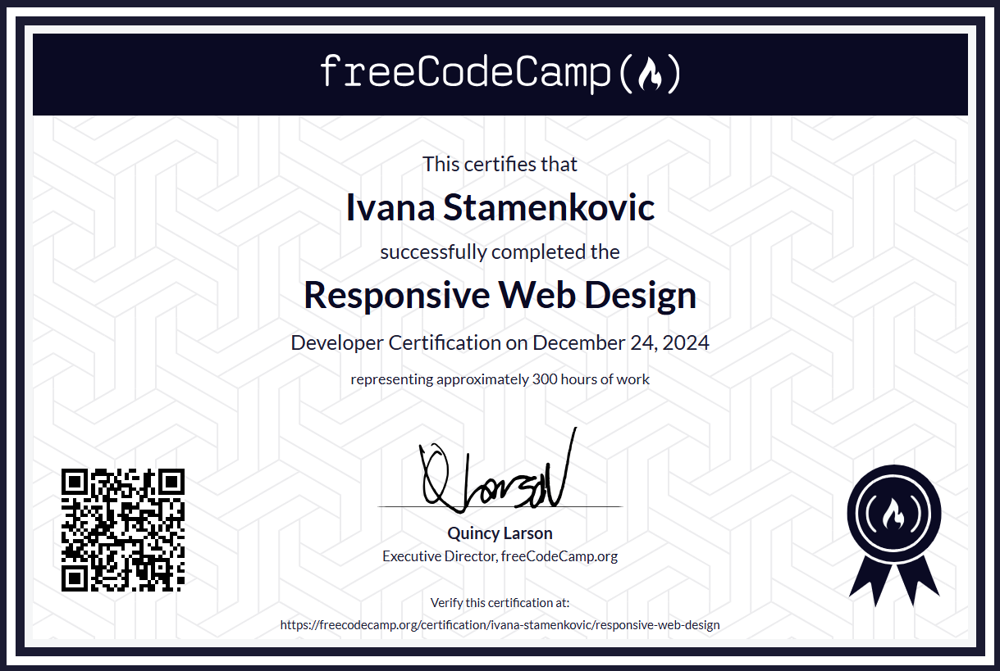

# freecodecamp-responsive-web-design
Certification projects done for Responsive Web Design Certification on freeCodeCamp.

In order to receive the certification, I had to complete all the projects listed below (to fulfil the given user stories and pass all the tests). I gave a personal style to each project.

## Certification Projects:
- [x] [Survey Form](https://fcc-survey-form-ivana.netlify.app/)
- [x] [Tribute Page](https://fcc-tribute-page-ivana.netlify.app/)
- [x] [Technical Documentation Page](https://fcc-technical-doc-page-ivana.netlify.app/)
- [x] [Landing Page](https://fcc-landing-page-ivana.netlify.app/)
- [x] [Personal Portfolio Webpage](https://fcc-webpage-portfolio.netlify.app/)

These projects were created as part of a course, with the primary goal of fulfilling the requirements outlined in the specifications for each individual project. As a result, not all functionalities are fully implemented, and the site may not display optimally on mobile devices or screens with significantly higher resolutions than standard.

 

p>
